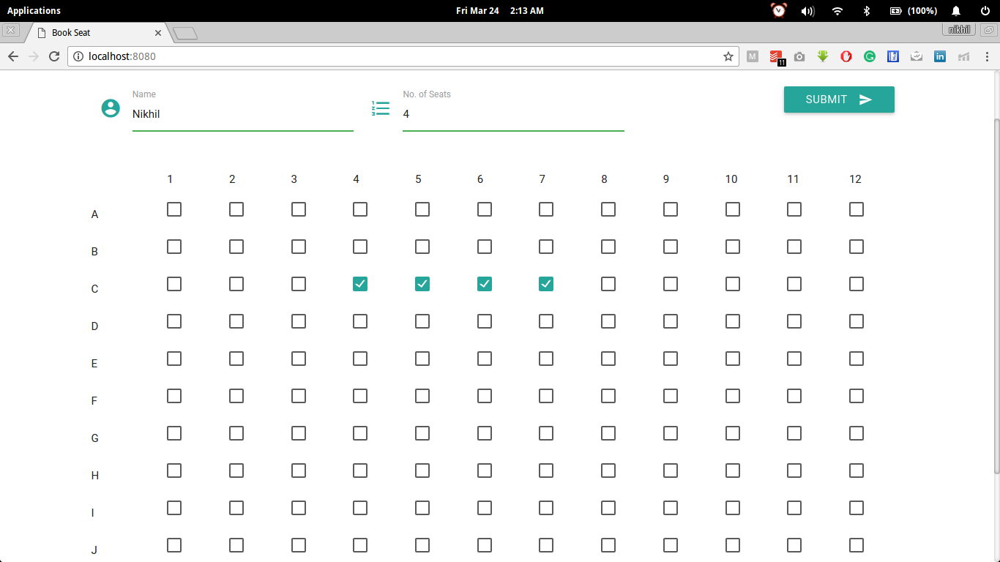
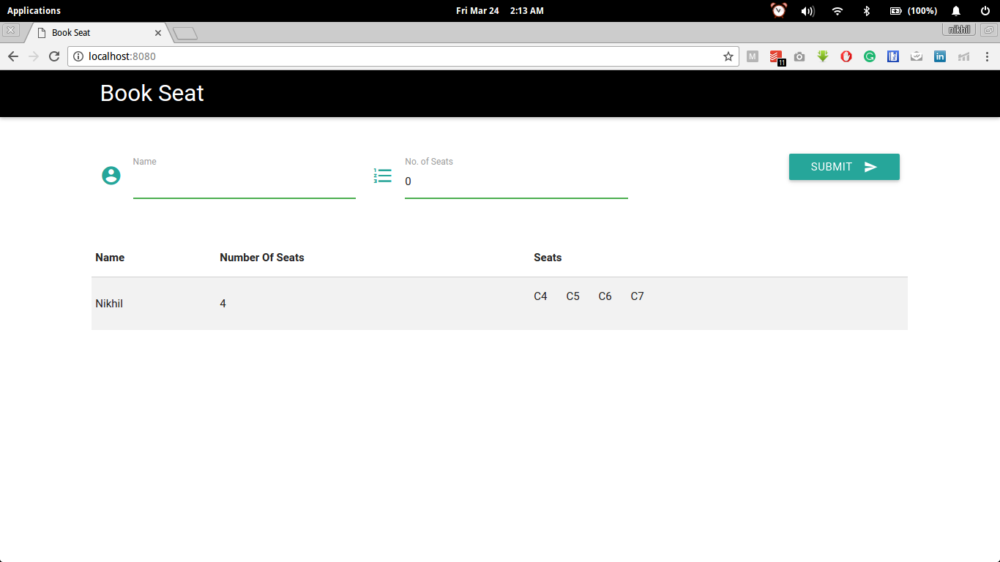

# Seat Booking(Code Brahma Assignment)

It is simple seat booking application built using angularjs.





## Getting Started

These instructions will get you a copy of the project up and running on your local machine for development and testing purposes.

### Prerequisites

What things you need to install the software

```
http-server
```


## Running the app

Use below command, to start the server locally
```
http-server
```
After that, type 
```
http://localhost:8080/
```
in the browser.

### Functionalities

* User can book seats.
* Booked Seat will be displayed in the table.
* Due to use of local storage, data will not disappear from the table.

## Authors

* **Nikhil Mehandiratta** - *Initial work* - [someone12321](https://github.com/someone12321)
